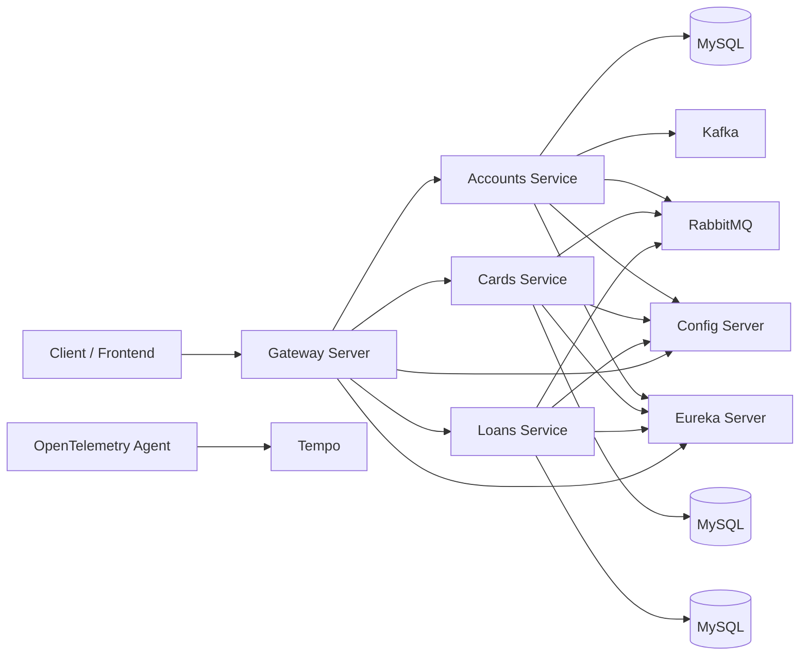

# Spring Boot Microservices Cloud Native Bank App

A cloud-native app built as a microservices system using Spring Boot and Spring Cloud. This repository was developed as a hands-on implementation while learning from the Udemy course "Master Microservices with SpringBoot,Docker,Kubernetes".

## Why This Project
This project helped me move from theory to real implementation. Along the way, I learned not only what to build, but also what I did not know I did not know about distributed systems, deployment workflows, and production concerns.

## Architecture Diagram


## Technologies Used
- Java 21
- Spring Boot
- Spring Cloud (Config Server, Service Discovery, API Gateway)
- Spring Security (for microservices security patterns)
- Maven
- Docker and Docker Compose
- Kubernetes
- Helm
- MySQL
- Apache Kafka
- RabbitMQ
- OpenTelemetry and Tempo (tracing)

## Repository Structure
- `accounts`, `cards`, `loans`: Core domain microservices
- `configserver`: Centralized configuration service
- `eurekaserver`: Service discovery
- `gatewayserver`: API gateway entry point
- `message`: Messaging support service
- `docker-compose`: Local multi-service orchestration (default, qa, prod, observability)
- `kubernetes`: Raw Kubernetes manifests
- `helm`: Helm charts for platform and environment deployments

## Key Features
- Domain-driven microservice split for banking capabilities
- Centralized externalized configuration via Config Server
- Service registration and discovery via Eureka
- API routing and edge concerns via Gateway Server
- Event-driven integration support via Kafka
- Containerized services with Docker
- Kubernetes-ready manifests and Helm-based deployments
- Environment-specific deployment options (dev, qa, prod)
- Distributed tracing integration through OpenTelemetry

## How To Run Locally (Docker Compose)
### Prerequisites
- Docker Desktop
- Java 21 (if running services outside Docker)
- Maven (or use `mvnw` wrappers in each service)

### Start local stack
From repository root:
```bash
cd docker-compose/default
docker compose up -d
```

### Verify services
```bash
docker compose ps
```

### Stop local stack
```bash
docker compose down
```

## Run Individual Services Locally (Optional)
Example for one service:
```bash
cd accounts
./mvnw spring-boot:run
```
Use `mvnw.cmd` on Windows PowerShell/CMD:
```powershell
.\mvnw.cmd spring-boot:run
```

## Kubernetes Deployment Instructions
### 1. Apply manifests directly
```bash
kubectl apply -f kubernetes/1_keycloak.yml
kubectl apply -f kubernetes/2_configmaps.yml
kubectl apply -f kubernetes/3_configserver.yml
kubectl apply -f kubernetes/4_eurekaserver.yml
kubectl apply -f kubernetes/5_accounts.yml
kubectl apply -f kubernetes/6_loans.yml
kubectl apply -f kubernetes/7_cards.yml
kubectl apply -f kubernetes/8_gateway.yml
```

### 2. Check deployment status
```bash
kubectl get deployments
kubectl get services
kubectl get pods
```

### 3. Helm-based deployment (recommended for environments)
This project includes environment umbrella charts in `helm/environments/`.

Example (dev):
```bash
cd helm/environments/dev-env
helm dependency update
helm upgrade --install dev-env . -n dev -f values.yaml --create-namespace
```

Use equivalent folders for QA and PROD environments.


## Kubectl Essential Commands
### Dashboard
To access the Kubernetes dashboard:
```bash
kubectl -n kubernetes-dashboard port-forward svc/kubernetes-dashboard-kong-proxy 8443:443
```
To generate a login token for Dashboard (ServiceAccount `admin-user`):
```bash
kubectl -n kubernetes-dashboard create token admin-user
```

### Common Commands
- Get deployments
```bash
kubectl get deployments
```
- Get services
```bash
kubectl get services
```
- Get replicasets
```bash
kubectl get replicaset
```
- Get pods
```bash
kubectl get pods
```

## Helm Essential Commands
### Dependencies
Update or fetch chart dependencies:
```bash
helm dependency update
```
Build dependencies from an existing lock file:
```bash
helm dependency build
```

### Render templates locally
Render manifests without applying to cluster:
```bash
helm template <release-name> .
```
Render with values file:
```bash
helm template <release-name> . -f values.yaml
```
Render with debug output:
```bash
helm template <release-name> . -f values.yaml --debug
```

### Lint
```bash
helm lint . -f values.yaml
```

### Install and upgrade
Dry run install:
```bash
helm install <release-name> . -n <namespace> --dry-run --debug -f values.yaml
```
Install:
```bash
helm install <release-name> . -n <namespace> -f values.yaml
```
Upgrade or install:
```bash
helm upgrade --install <release-name> . -n <namespace> -f values.yaml
```

### Inspect releases
List releases in namespace:
```bash
helm list
```
List all namespaces:
```bash
helm list -A
```
Release status:
```bash
helm status <release-name>
```
Release values:
```bash
helm get values <release-name>
```

### Uninstall
```bash
helm uninstall <release-name> -n <namespace>
```
